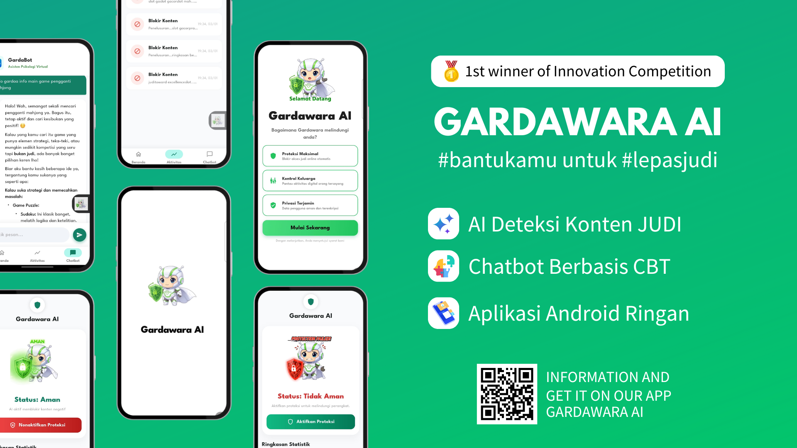

  

# Gardawara AI - 1st of Innovation Competition

**Gardawara AI** adalah aplikasi mobile berbasis Artificial Intelligence yang dirancang untuk pendampingan dan dukungan kesehatan mental pengguna, serta fitur keamanan cerdas. Aplikasi ini menggabungkan kekuatan framework **Flutter** untuk antarmuka yang responsif, **CBT (Cognitive Behavioral Therapy)** dalam fitur Chatbot, dan **TensorFlow Lite** untuk pemrosesan cerdas langsung di perangkat.

---

## 🚀 Fitur Unggulan

### 1. ⚛️ Built with Flutter
Dikembangkan menggunakan **Flutter SDK**, memastikan aplikasi berjalan mulus dan performa tinggi di berbagai platform dengan satu basis kode (Single Codebase). Antarmuka pengguna (UI) dirancang modern dan intuitif.

### 2. 🤖 Chatbot CBT (Cognitive Behavioral Therapy)
Fitur inti **Chatbot** yang terintegrasi. Chatbot ini tidak hanya sekadar menjawab, tetapi dirancang dengan pendekatan **CBT** untuk membantu pengguna mengelola stres, kecemasan, dan memberikan dukungan emosional yang terstruktur.

### 3. 🧠 TensorFlow Lite Integration
Dilengkapi dengan **TensorFlow Lite** (`assets/models/model_safe.tflite`) untuk kemampuan Machine Learning on-device. Memungkinkan aplikasi melakukan klasifikasi cerdas dan analisis teks (`vocab_safe.txt`) secara offline tanpa ketergantungan penuh pada server, menjaga privasi dan kecepatan respon.

---
